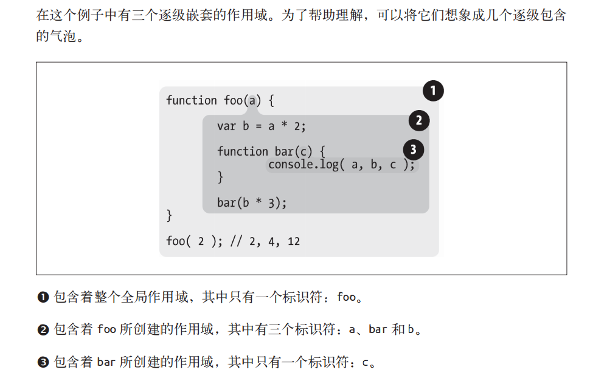
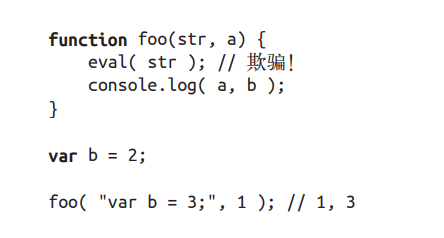
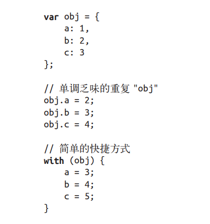

作用域有两种主要的工作方式：词法作用域（最为普遍）和动态作用域。

## 词法阶段
词法作用域是由你在写代码时将变量和块作用域写在哪里来决定的。

作用域查找会在找到第一个匹配的标识符时停止。

函数的词法作用域只由函数被声明的时所处的位置决定。

词法作用域只会查找一级标识符，若代码中引用了foo.bar.baz,词法作用域只会试图去查找foo标识符，查到该变量后，对象属性访问规则会分别接管对bar和baz属性的访问。

## 欺骗词法
怎样在运行时修改（欺骗）词法作用域？ 
JS有两种机制来实现这个目的。欺骗词法作用域会导致性能下降。

### eval
JavaScript 中的 eval(..) 函数可以接受一个字符串为参数，并将其中的内容视为好像在书
写时就存在于程序中这个位置的代码。

### with
JavaScript 中另一个难以掌握（并且现在也不推荐使用）的用来欺骗词法作用域的功能是
with 关键字。with 通常被当作重复引用同一个对象中的多个属性的快捷方式，可以不需要重复引用对象本身。

eval(..) 函数如果接受了含有一个或多个声明的代码，就会修改其所处的词法作用域，而
with 声明实际上是根据你传递给它的对象凭空创建了一个全新的词法作用域。

## 小结
词法作用域意味着作用域是由书写代码时函数声明的位置来决定的。编译的词法分析阶段
基本能够知道全部标识符在哪里以及是如何声明的，从而能够预测在执行过程中如何对它
们进行查找。

JavaScript 中有两个机制可以“欺骗”词法作用域：eval(..) 和 with。

前者可以对一段包含一个或多个声明的“代码”字符串进行演算，并借此来修改已经存在的词法作用域（在运行时）。

后者本质上是通过将一个对象的引用当作作用域来处理，将对象的属性当作作用域中的标识符来处理，从而创建了一个新的词法作用域（同样是在运行时）。

这两个机制的副作用是引擎无法在编译时对作用域查找进行优化，因为引擎只能谨慎地认
为这样的优化是无效的。使用这其中任何一个机制都将导致代码运行变慢。不要使用它们。
