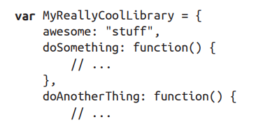
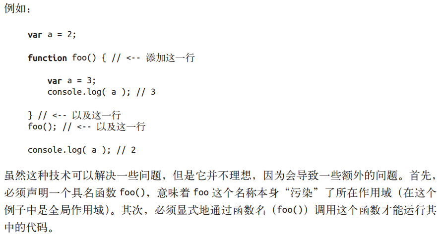
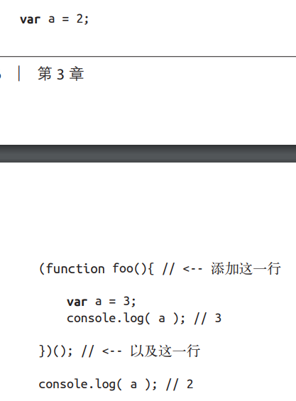
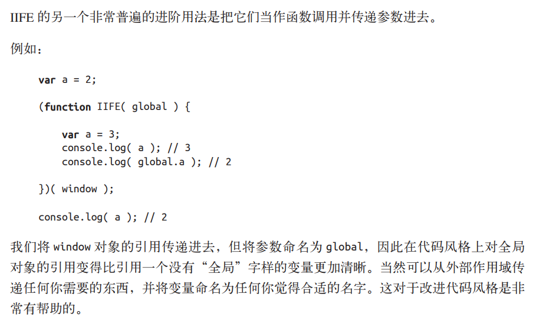
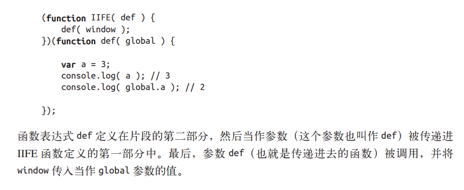
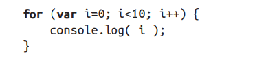
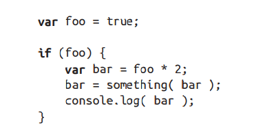

## 函数中的作用域
函数作用域的含义是指，属于这个函数的全部变量都可以在整个函数的范围内使用及复用（事实上在嵌套的作用域中也可以使用）。

1. 全局命名空间

变量冲突的一个典型例子存在于全局作用域中。当程序中加载了多个第三方库时，如果它们没有妥善地将内部私有的函数或变量隐藏起来，就会很容易引发冲突。

这些库通常会在全局作用域中声明一个名字足够独特的变量，通常是一个对象。这个对象被用作库的命名空间，所有需要暴露给外界的功能都会成为这个对象（命名空间）的属性，而不是将自己的标识符暴漏在顶级的词法作用域中。

2. 模块管理

使用一些工具，任何库都无需将标识符加入到全局作用域中，而是通过依赖管理器
的机制将库的标识符显式地导入到另外一个特定的作用域中。如：require.js等

3. 函数作用域

在任意代码片段外部添加包装函数，可以将内部的变量和函数定义“隐藏”起来，外部作用域无法访问包装函数内部的任何内容。

如果函数不需要函数名（函数名可以不污染所在作用域），并且能够自动运行，这将更理想，js提供了解决方案IIFE。

区分函数声明和表达式最简单的方法是看 function 关键字出现在声明中的位置（不仅仅是一行代码，而是整个声明中的位置）。如果 function 是声明中的第一个词，那么就是一个函数声明，否则就是一个函数表达式。

(function foo(){ .. }) 作为函数表达式意味着 foo 只能在 .. 所代表的位置中被访问，外部作用域则不行。foo 变量名被隐藏在自身中意味着不会非必要污染外部作用域。

始终给函数表达式命名是一个最佳实践.

是倒置代码的运行顺序，将需要运行的函数放在第二位，在 IIFE执行之后当作参数传递进去。

4. 块作用域

表面上看 JavaScript 并没有块作用域的相关功能。

我们在 for 循环的头部直接定义了变量 i，通常是因为只想在 for 循环内部的上下文中使
用 i，而忽略了 i 会被绑定在外部作用域（函数或全局）中的事实。

bar 变量仅在 if 声明的上下文中使用，因此如果能将它声明在 if 块内部中会是一个很有意义的事情。但是，当使用 var 声明变量时，它写在哪里都是一样的，因为它们最终都会属于外部作用域。这段代码是为了风格更易读而伪装出的形式上的块作用域，如果使用这种形式，要确保没在作用域其他地方意外地使用 bar 只能依靠自觉性。

try/catch

catch会创建一个块作用域，其声明的变量只会在catch中有效。

let

es6引入的let关键字，可以将变量绑定到所在的任意作用域中（通常是 { .. } 内部）。使用 let 进行的声明不会在块作用域中进行提升。声明的代码被运行之前，声明并不“存在”。

const

es6引入，同样可以创建块作用域。

## 小结
函数是 JavaScript 中最常见的作用域单元。本质上，声明在一个函数内部的变量或函数会在所处的作用域中“隐藏”起来，这是有意为之的良好软件的设计原则。

但函数不是唯一的作用域单元。块作用域指的是变量和函数不仅可以属于所处的作用域，也可以属于某个代码块（通常指 { .. } 内部）。

从 ES3 开始，try/catch 结构在 catch 分句中具有块作用域。

在 ES6 中引入了 let 关键字（var 关键字的表亲），用来在任意代码块中声明变量。if(..) { let a = 2; } 会声明一个劫持了 if 的 { .. } 块的变量，并且将变量添加到这个块中。

有些人认为块作用域不应该完全作为函数作用域的替代方案。两种功能应该同时存在，开发者可以并且也应该根据需要选择使用何种作用域，创造可读、可维护的优良代码。

