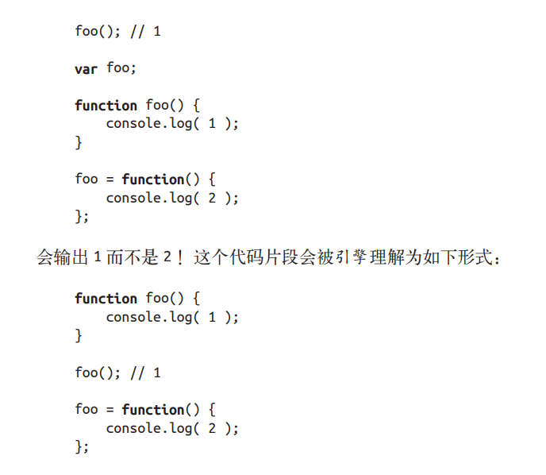

## 提升
任何声明在某个作用域内的变量，都将附属于这个作用域。

变量和函数声明从它们在代码中出现的位置被“移动”到了最上面。这个过程就叫作提升。

函数声明会被提升，但是函数表达式却不会被提升。

函数声明和变量声明都会被提升，但函数会首先被提升（可以出现在多个“重复”声明的代码中），然后才是变量。

函数优先提升

## 小结
我们习惯将 var a = 2; 看作一个声明，而实际上 JavaScript 引擎并不这么认为。它将 var a和 a = 2 当作两个单独的声明，第一个是编译阶段的任务，而第二个则是执行阶段的任务。

这意味着无论作用域中的声明出现在什么地方，都将在代码本身被执行前首先进行处理。可以将这个过程形象地想象成所有的声明（变量和函数）都会被“移动”到各自作用域的最顶端，这个过程被称为提升。

声明本身会被提升，而包括函数表达式的赋值在内的赋值操作并不会提升。要注意避免重复声明，特别是当普通的 var 声明和函数声明混合在一起的时候，否则会引起很多危险的问题！
