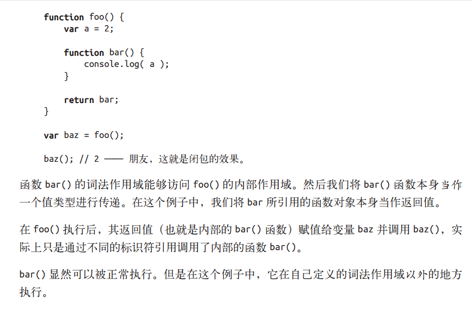
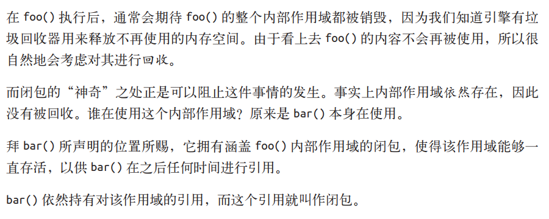
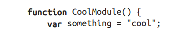
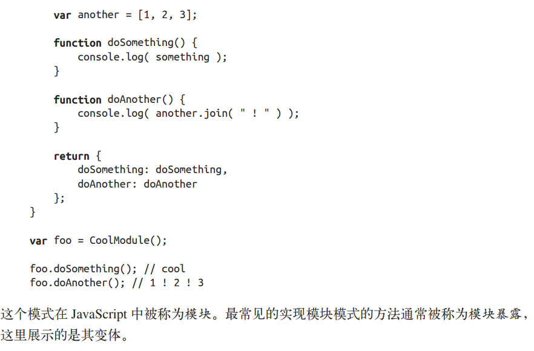
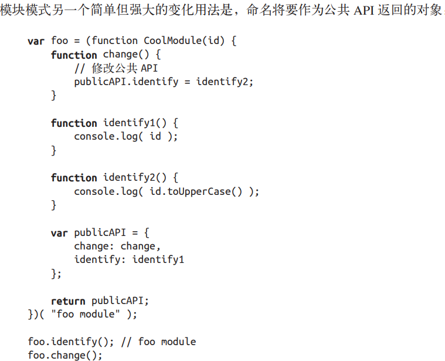

## 启示
JavaScript中闭包无处不在，你只需要能够识别并拥抱它。

闭包是基于词法作用域书写代码时所产生的自然结果，你甚至不需要为了利用它们而有意识地创建闭包。闭包的创建和使用在你的代码中随处可见。你缺少的是根据你自己的意愿来识别、拥抱和影响闭包的思维环境。

## 实质问题
当函数可以记住并访问所在的词法作用域时，就产生了闭包，即使函数是在当前词法作用域之外执行。

下面清晰的展示了闭包：

无论通过何种手段将内部函数传递到所在的词法作用域以外，它都会持有对原始定义作用域的引用，无论在何处执行这个函数都会使用闭包。

模块(利用闭包)

模块需要具备两个必要条件：
1. 必须有外部的封闭函数，该函数必须至少被调用一次（每次调用都会创建一个新的模块实例）。
2. 封闭函数必须返回至少一个内部函数，这样内部函数才能在私有作用域中形成闭包，并且可以访问或者修改私有的状态。

foo.identify(); // FOO MODULE

通过在模块实例的内部保留对公共 API 对象的内部引用，可以从内部对模块实例进行修
改，包括添加或删除方法和属性，以及修改它们的值。

现代的模块机制

大多数模块依赖加载器 / 管理器本质上都是将这种模块定义封装进一个友好的 API。

未来的模块机制->ES6 

## 小结
闭包就好像从 JavaScript 中分离出来的一个充满神秘色彩的未开化世界，只有最勇敢的人才能够到达那里。但实际上它只是一个标准，显然就是关于如何在函数作为值按需传递的词法环境中书写代码的。

当函数可以记住并访问所在的词法作用域，即使函数是在当前词法作用域之外执行，这时就产生了闭包。

如果没能认出闭包，也不了解它的工作原理，在使用它的过程中就很容易犯错，比如在循环中。但同时闭包也是一个非常强大的工具，可以用多种形式来实现模块等模式。

模块有两个主要特征：（1）为创建内部作用域而调用了一个包装函数；（2）包装函数的返回值必须至少包括一个对内部函数的引用，这样就会创建涵盖整个包装函数内部作用域的闭包。

现在我们会发现代码中到处都有闭包存在，并且我们能够识别闭包然后用它来做一些有用的事！