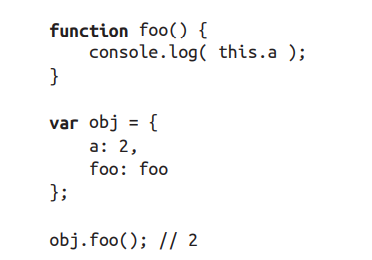

调用栈和调用位置：

绑定规则（4条）

默认绑定：独立函数调用->非严格模式：绑定到全局变量，严格模式下与函数本身调用位置无关。

隐式绑定：

 foo() 被调用时，它的落脚点确实指向 obj 对象。当函数引用有上下文对象时，隐式绑定规则会把函数调用中的 this 绑定到这个上下文对象。

显示绑定：

可以使用函数的 call(..) 和apply(..) 方法在某个对象上强制调用函数。

new绑定

JavaScript 中，构造函数只是一些使用 new 操作符时被调用的函数。它们并不会属于某个类，也不会实例化一个类。实际上，它们甚至都不能说是一种特殊的函数类型，它们只是被 new 操作符调用的普通函数而已。

包括内置对象函数（比如 Number(..)，详情请查看第 3 章）在内的所有函数都可以用 new 来调用，这种函数调用被称为构造函数调用。这里有一个重要但是非常细微的区别：实际上并不存在所谓的“构造函数”，只有对于函数的“构造调用”。

使用 new 来调用函数，或者说发生构造函数调用时，会自动执行下面的操作。
1. 创建（或者说构造）一个全新的对象。
2. 这个新对象会被执行 [[ 原型 ]] 连接。
3. 这个新对象会绑定到函数调用的 this。
4. 如果函数没有返回其他对象，那么 new 表达式中的函数调用会自动返回这个新对象。

绑定规则（4条）优先级

现在我们可以根据优先级来判断函数在某个调用位置应用的是哪条规则。可以按照下面的
顺序来进行判断：
1. 函数是否在 new 中调用（new 绑定）？如果是的话 this 绑定的是新创建的对象。
var bar = new foo()
2. 函数是否通过 call、apply（显式绑定）或者硬绑定调用？如果是的话，this 绑定的是
指定的对象。
var bar = foo.call(obj2)
3. 函数是否在某个上下文对象中调用（隐式绑定）？如果是的话，this 绑定的是那个上
下文对象。
var bar = obj1.foo()
4. 如果都不是的话，使用默认绑定。如果在严格模式下，就绑定到 undefined，否则绑定到
全局对象。
var bar = foo()

绑定例外

被忽略的this

如果你把 null 或者 undefined 作为 this 的绑定对象传入 call、apply 或者 bind，这些值在调用时会被忽略，实际应用的是默认绑定规则：

this词法

箭头函数不使用 this 的四种标准规则，而是根据外层（函数或者全局）作用域来决定 this。箭头函数的绑定无法被修改。

## 小结
如果要判断一个运行中函数的 this 绑定，就需要找到这个函数的直接调用位置。找到之后就可以顺序应用下面这四条规则来判断 this 的绑定对象。

1. 由 new 调用？绑定到新创建的对象。
2. 由 call 或者 apply（或者 bind）调用？绑定到指定的对象。
3. 由上下文对象调用？绑定到那个上下文对象。
4. 默认：在严格模式下绑定到 undefined，否则绑定到全局对象。

一定要注意，有些调用可能在无意中使用默认绑定规则。如果想“更安全”地忽略 this 绑定，你可以使用一个 DMZ 对象，比如 ø = Object.create(null)，以保护全局对象。

ES6 中的箭头函数并不会使用四条标准的绑定规则，而是根据当前的词法作用域来决定this，具体来说，箭头函数会继承外层函数调用的 this 绑定（无论 this 绑定到什么）。这其实和 ES6 之前代码中的 self = this 机制一样。
