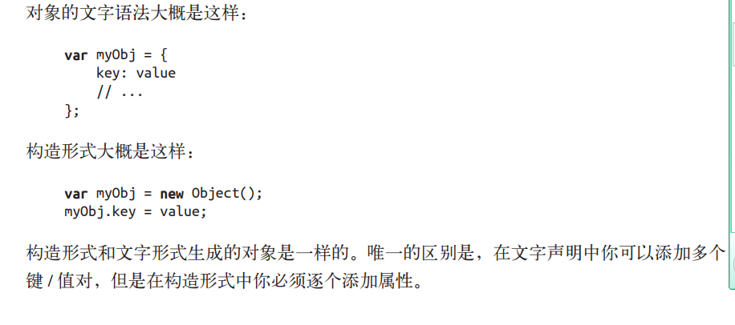
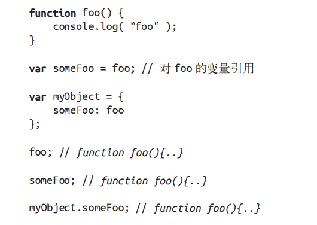
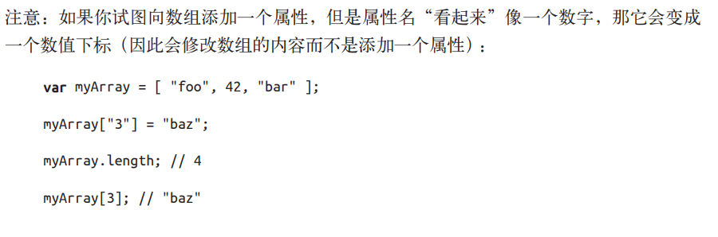

## 语法
对象可以通过两种形式定义：声明（文字）形式和构造像是。

## 类型
6中主要类型：string、number、boolean、null、undefined、object。

基本类型：string、number、boolean、null、undefined，其本身并不是对象。typeof null 返回‘object’,null本身不是对象。

函数是对象的一个子类型（可调用的对象），数组也是对象的一种类型。

## 内置对象
js对象子类型：通常被称为内置对象。

String/Number/Boolean/Object/Function/Array/Date/RegExp/Error，他们实际上只是一些内置函数，可以当做构造函数来使用，从而可以构造一个对应子类型的新对象。如下：

    var strPrimitive = "I am a string";
    typeof strPrimitive; // "string"
    strPrimitive instanceof String; // false
    var strObject = new String( "I am a string" );
    typeof strObject; // "object"
    strObject instanceof String; // true

// 检查 sub-type 对象

Object.prototype.toString.call( strObject ); // [object String]

原始值 "I am a string" 并不是一个对象，它只是一个字面量，并且是一个不可变的值。如果要在这个字面量上执行一些操作，比如获取长度、访问其中某个字符等，那需要将其转换为 String 对象。必要时，语言会自动转换为对象。

null/undefined没有对应的构造形式，他们只有文字形式。Date只有构造，没有文字形式。

对于 Object、Array、Function 和 RegExp（正则表达式）来说，无论使用文字形式还是构造形式，它们都是对象，不是字面量。

## 内容
对象的内容是由一些存储在特定命名位置的（任意类型的）值组成的，我们称之为属性。

属性访问：使用 . 操作符或者 [] 操作符。

    var myObject = {
    a: 2
    };
    myObject.a; // 2
    myObject["a"]; // 2

在对象中，属性名永远都是字符串。

## 属性和方法

someFoo 和 myObject.someFoo 只是对于同一个函数的不同引用，并不能说明这个函数是特别的或者“属于”某个对象。

## 数组
数组也是对象，所以虽然每个下标都是整数，你仍然可以给数组添加属性：

    var myArray = [ "foo", 42, "bar" ];
    myArray.baz = "baz";
    myArray.length; // 3
    myArray.baz; // "baz"

可以看到虽然添加了命名属性（无论是通过 . 语法还是 [] 语法），数组的 length 值并未发生变化。

最好只用对象来存储键 / 值对，只用数组来存储数值下标 / 值对。

## 复制对象
于浅拷贝来说，复制出的新对象中 a 的值会复制旧对象中 a 的值，也就是 2，但是新对象中 b、c、d 三个属性其实只是三个引用，它们和旧对象中 b、c、d 引用的对象是一样的。对于深复制来说，除了复制 myObject 以外还会复制 anotherObject 和 anotherArray。这时问题就来了，anotherArray 引用了 anotherObject 和myObject，所以又需要复制 myObject，这样就会由于循环引用导致死循环。

ES6定义了Object.assign(..) 方法来实现浅复制。Object.assign(..) 方法的第一个参数是目标对象，之后还可以跟一个或多个源对象。它会遍历一个或多个源对象的所有可枚举（enumerable，参见下面的代码）的自有键（owned key，很快会介绍并把它们复制（使用 = 操作符赋值）到目标对象，最后返回目标对象，如下：

    var newObj = Object.assign( {}, myObject );
    newObj.a; // 2
    newObj.b === anotherObject; // true
    newObj.c === anotherArray; // true
    newObj.d === anotherFunction; // true

## 属性描述符
    var myObject = {
    a:2
    };
    Object.getOwnPropertyDescriptor( myObject, "a" );
    // {
    // value: 2,
    // writable: true,
    // enumerable: true,
    // configurable: true
    // }
这个普通的对象属性对应的属性描述符（也被称为“数据描述符”，因为它只保存一个数据值）可不仅仅只是一个 2。它还包含另外三个特性：writable（可写）、enumerable（可枚举）和 configurable（可配置）。

我们也可以使用 Object.defineProperty(..)来添加一个新属性或者修改一个已有属性（如果它是 configurable）并对特性进行设置。如下：

    var myObject = {};
    Object.defineProperty( myObject, "a", {
    value: 2,
    writable: true,
    configurable: true,
    enumerable: true
    } );
    myObject.a; // 2

writable 决定是否可以修改属性的值。

Configurable 只要属性是可配置的，就可以使用 defineProperty(..) 方法来修改属性描符，但是有一个小小的例外：即便属性是 configurable:false，我们还是可以把 writable 的状态由 true 改为 false，但是无法由 false 改为 true。

Enumerable 属性是否会出现在对象的属性枚举中

## 不变性
对象常量：结合 writable:false 和 configurable:false 就可以创建一个真正的常量属性（不可修改、重定义或者删除）

禁止扩展：如果你想禁止一个对象添加新属性并且保留已有属性，可以使用 Object.preventExtensions(..)

密封：密封之后不仅不能添加新属性，也不能重新配置或者删除任何现有属性（虽然可以修改属性的值）。

Object.seal(..) 会创建一个“密封”的对象，这个方法实际上会在一个现有对象上调用Object.preventExtensions(..) 并把所有现有属性标记为 configurable:false。

冻结：Object.freeze(..) 会创建一个冻结对象，这个方法实际上会在一个现有对象上调用Object.seal(..) 并把所有“数据访问”属性标记为 writable:false，这样就无法修改它们的值。

## Getter和Setter
在 ES5 中可以使用 getter 和 setter 部分改写默认操作，但是只能应用在单个属性上，无法应用在整个对象上。

当你给一个属性定义 getter、setter 或者两者都有时，这个属性会被定义为“访问描述符”（和“数据描述符”相对）。对于访问描述符来说，JavaScript 会忽略它们的 value 和writable 特性，取而代之的是关心 set 和 get（还有 configurable 和 enumerable）特性。

    var myObject = {
    // 给 a 定义一个 getter
    get a() {
    return this._a_;
    },
    // 给 a 定义一个 setter
    set a(val) {
    this._a_ = val * 2;
    }
    };
    myObject.a = 2;
    myObject.a; // 4

## 存在性
myObject.a 的属性访问返回值可能是 undefined，但是这个值有可能是属性中存储的 undefined，也可能是因为属性不存在所以返回 undefined。那么如何区分这两种情况呢？

    var myObject = {
    a:2
    };
    ("a" in myObject); // true
    ("b" in myObject); // false
    myObject.hasOwnProperty( "a" ); // true
    myObject.hasOwnProperty( "b" ); // false

in 操作符会检查属性是否在对象及其 [[Prototype]] 原型链中，hasOwnProperty(..) 只会检查属性是否在 myObject 对象中，不会检查 [[Prototype]] 链。

在数组上应用 for..in 循环有时会产生出人意料的结果，因为这种枚举不仅会包含所有数值索引，还会包含所有可枚举属性。最好只在对象上应用for..in 循环，如果要遍历数组就使用传统的 for 循环来遍历数值索引。

## 可枚举
propertyIsEnumerable(..) 会检查给定的属性名是否直接存在于对象中（而不是在原型链
上）并且满足 enumerable:true。

Object.keys(..) 会返回一个数组，包含所有可枚举属性，Object.getOwnPropertyNames(..)会返回一个数组，包含所有属性，无论它们是否可枚举。

in 和 hasOwnProperty(..) 的区别在于是否查找 [[Prototype]] 链，然而，Object.keys(..)和 Object.getOwnPropertyNames(..) 都只会查找对象直接包含的属性。

## 遍历
遍历数组下标时采用的是数字顺序（for 循环或者其他迭代器），但是遍历对象属性时的顺序是不确定的。

## 小结
JavaScript 中的对象有字面形式（比如 var a = { .. }）和构造形式（比如 var a = new Array(..)）。字面形式更常用，不过有时候构造形式可以提供更多选项。

许多人都以为“JavaScript 中万物都是对象”，这是错误的。对象是 6 个（或者是 7 个，取决于你的点）基础类型之一。对象有包括 function 在内的子类型，不同子类型具有不同的行为，比如内部标签[object Array] 表示这是对象的子类型数组。

对象就是键 / 值对的集合。可以通过 .propName 或者 ["propName"] 语法来获取属性值。访问属性时，引擎实际上会调用内部的默认 [[Get]] 操作（在设置属性值时是 [[Put]]），[[Get]] 操作会检查对象本身是否包含这个属性，如果没找到的话还会查找 [[Prototype]]链（参见第 5 章）。

属性的特性可以通过属性描述符来控制，比如 writable 和 configurable。此外，可以使用Object.preventExtensions(..)、Object.seal(..) 和 Object.freeze(..) 来设置对象（及其属性）的不可变性级别。

属性不一定包含值——它们可能是具备 getter/setter 的“访问描述符”。此外，属性可以是可枚举或者不可枚举的，这决定了它们是否会出现在 for..in 循环中。

你可以使用 ES6 的 for..of 语法来遍历数据结构（数组、对象，等等）中的值，for..of会寻找内置或者自定义的 @@iterator 对象并调用它的 next() 方法来遍历数据值。