CSS3选择器分为5大类：基本选择器、层次选择器、伪类选择器、伪元素和属性选择器。
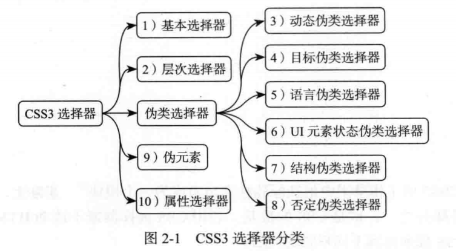

## 基本选择器
css1开始就支持，css选择器中使用最频繁、最基础的。
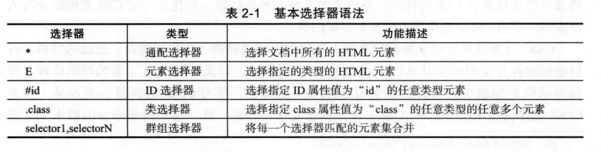
兼容性：所有浏览器都支持。

1. 通配选择器（*）：用来选择所有元素、或者某个元素下的所有元素；
2. 元素选择器（E）：HTML元素——包含html/body/p/ul/div等；
3. ID选择器（#id）：HTML文档中设置id属性并设置其值，其具有唯一性；
4. 类选择器（.class）：HTML文档中定义class属性，可以重复；
5. 群组选择器(selector1,selectorN)：具有相同样式的元素分组在一起；

## 层次选择器
层次选择器通过HTML的DOM元素间的层次关系获取元素，其主要的层次关系包括后代、父子、相邻兄弟和通用兄弟几种关系；

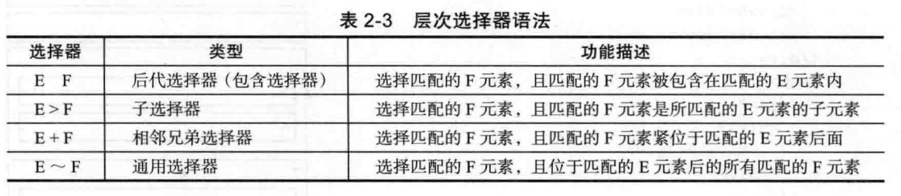
常用后代+子；兄弟和通用一般不常用；

兼容性：IE7+及其他；

## 动态伪类选择器
平时经常用的伪类选择器:link/:visited/:hover/:active；
CSS3的伪类选择器可分为6种：动态伪类、目标伪类、语言伪类、UI状态伪类、结构伪类、否定伪类。

1. 动态伪类选择器
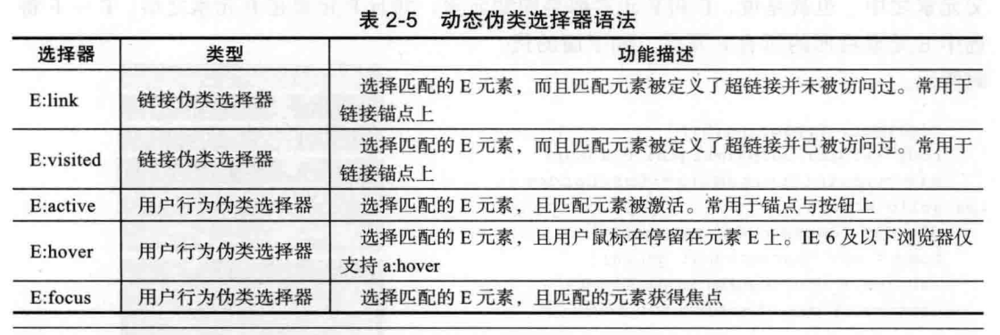
两种：锚点伪类（a）、用户行为伪类。

## 目标位类选择器
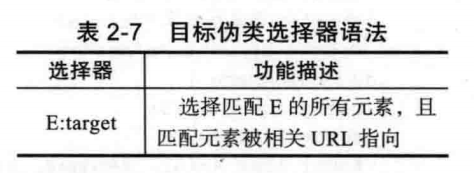
只用存在URL指向该匹配元素时，样式才会生效。

兼容性:IE9+、opera9.6

用法：URL 带有后面跟有锚名称 #，指向文档内某个具体的元素。这个被链接的元素就是目标元素(target element)。:target 选择器可用于选取当前活动的目标元素。

参照：http://www.w3school.com.cn/tiy/t.asp?f=css_sel_target

## 语言伪类选择器
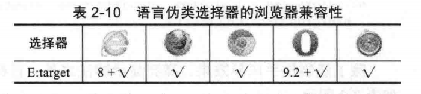

## UI元素状态伪类选择器
CSS3模块组中的一部分，主要用于form表单。
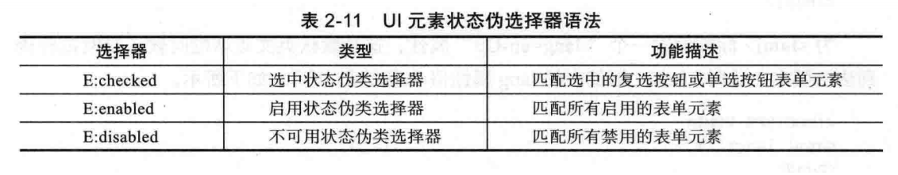
兼容性：IE9+及其他

## 结构伪类选择器
结构伪类都是基于HTML文档树的，如下：

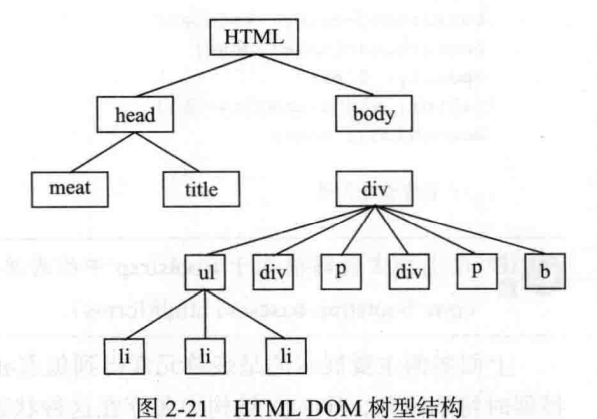

用法：
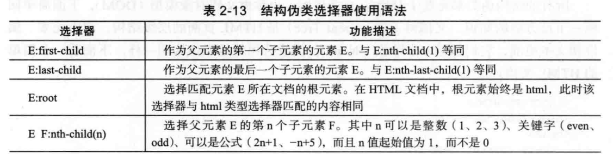
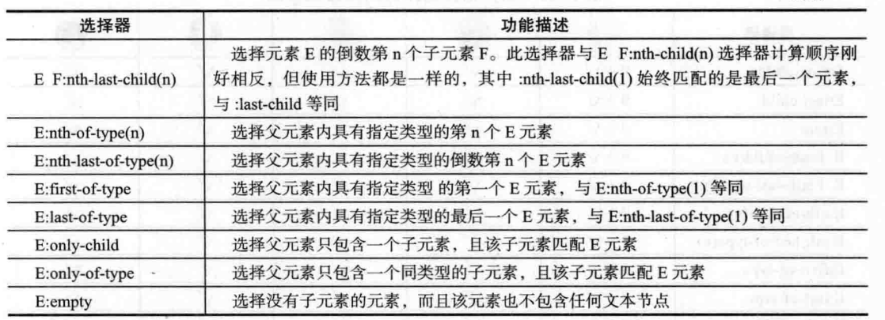
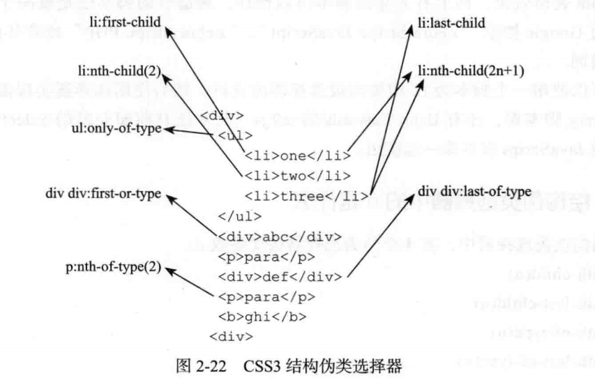

兼容性：IE9+及其他

## 否定伪类选择器
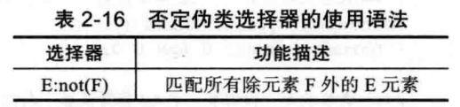

兼容性：IE9+及其他

##伪元素
定位文档中包含的文本，但无法在文档树中定位。

    ::first-letter 选择文本快的第一个字符；
    ::first-line 选择文本块的第一行文本；
    ::before和::after在元素的开头或结尾插入内容，需content配合；
    ::selection 匹配突出显示的文本；

## 属性选择器
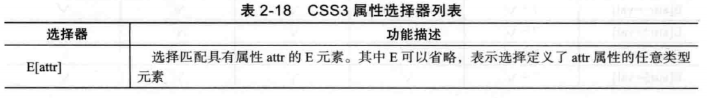
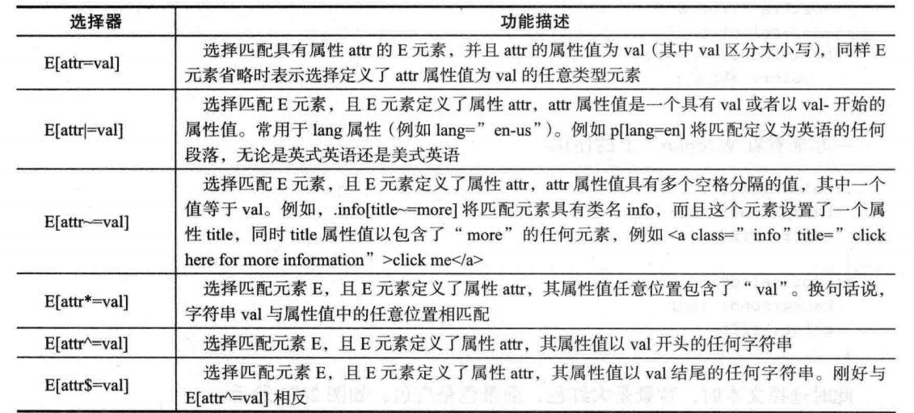

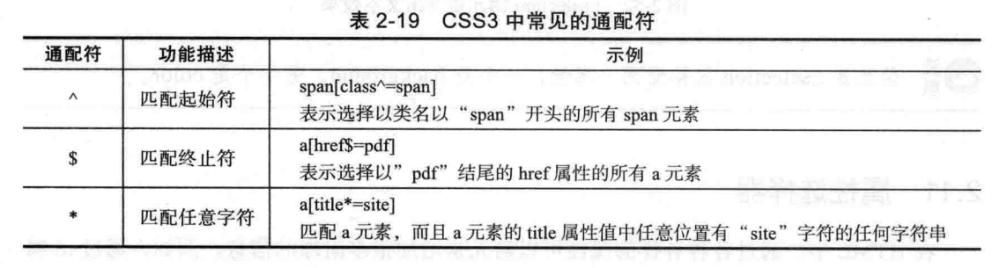

兼容性：IE7+及其他

