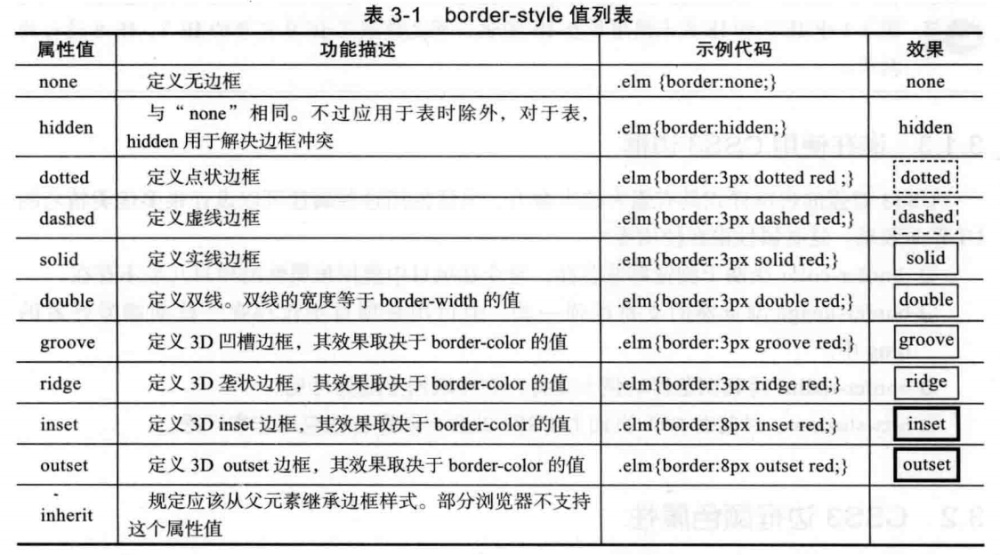
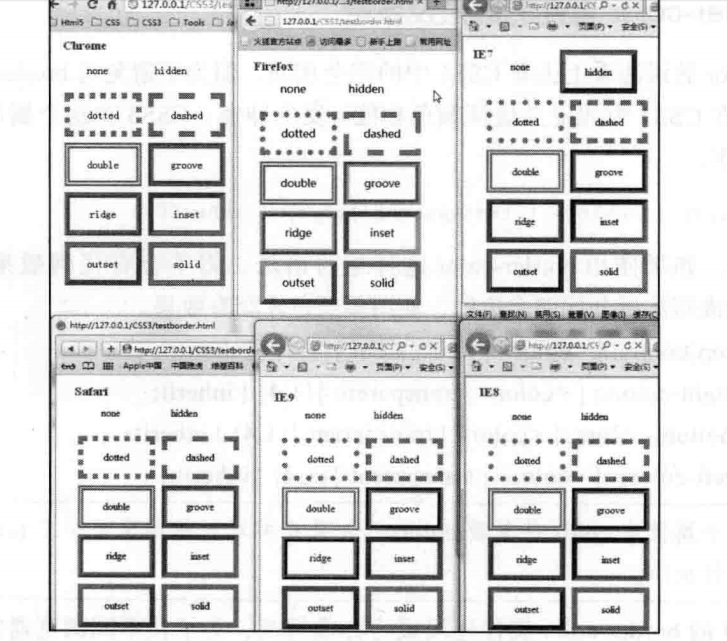
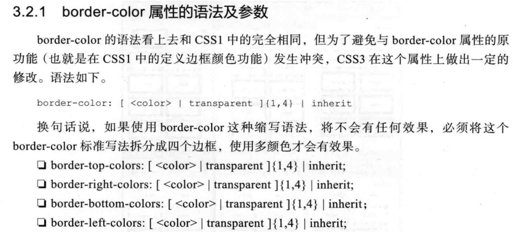
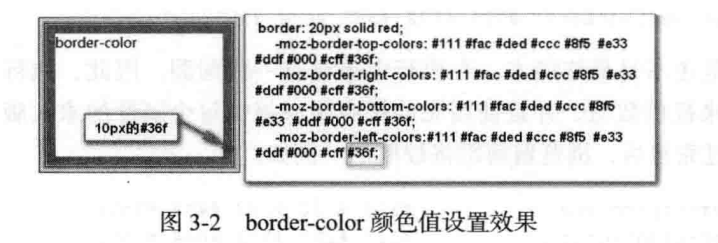
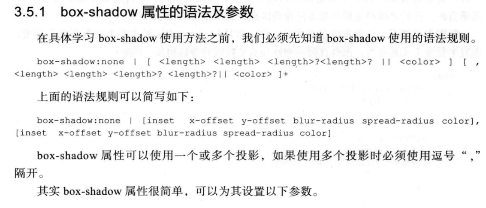
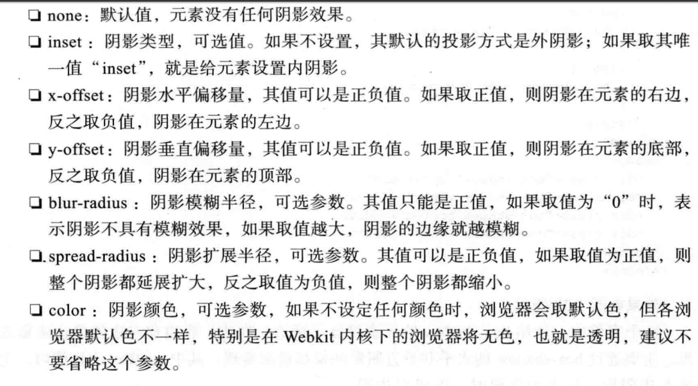

## 边框的基本属性
css1和css2边框：

    border-width:边框粗细
    border-color:颜色
    border-style:类型

边框的类型——实线solid、虚线dashed、点状dotted等

## border-color

注：加入元素的边框设置了20px，而颜色值只设置了10个，剩下的10px都将显示最后一个颜色。

## border-image 略（浏览器支持不是很好）
## border-radius圆角边框属性
    border-radius:top-left top-right bottom-right bottom-left 4个值
    border-radius:top-left=bottom-right top-right=bottom-left 2个值
    border-radius:top-left top-right=bottom-left bottom-right 3个值

兼容性：IE9+
IE8及以下使用——IE-CSS3.js或者PIE

## box-shadow

注：内阴影使用在img上没有效果。

兼容性：IE9+ 及  其他